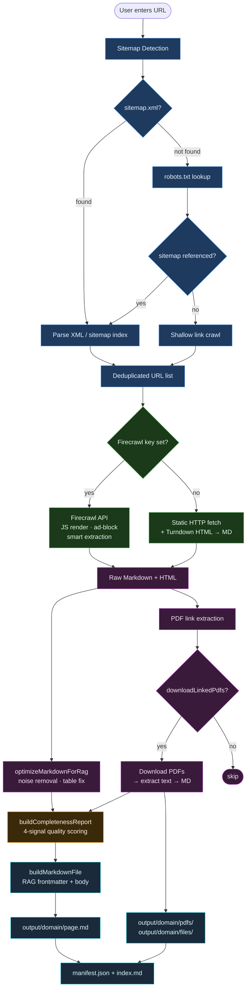

# Site Scraper MD

A local-first web corpus builder designed for RAG and AI research workflows. Point it at any site, discover pages from its sitemap, scrape them through [Firecrawl](https://firecrawl.dev), and write structured Markdown to disk — each file carrying rich YAML frontmatter that a retrieval pipeline can consume directly.

Built for documentation sites, product catalogs, and JavaScript-heavy pages where a plain HTTP fetch yields incomplete or missing content.

---

## How it works



---

## Features

| Feature | Description |
|---|---|
| Sitemap-first discovery | Resolves `/sitemap.xml`, `sitemap_index.xml`, and `robots.txt` references. Falls back to shallow link crawling when no sitemap is found. |
| Firecrawl integration | Full JavaScript rendering, ad blocking, and smart content extraction. Falls back to a static HTTP fetch when no API key is configured. |
| RAG-ready output | Every page file includes YAML frontmatter with pre-computed token estimates, content hashes, embed strings, chunk section boundaries, and quality grades. |
| 4-signal completeness scoring | Pages are scored on content volume, link density, noise heuristics, and structural richness. Low-grade pages are flagged so you can exclude them from your embedding index. |
| PDF support | Detects linked PDFs on each page, downloads the binaries to `files/`, and extracts text to Markdown under `pdfs/`. |
| Virtualised table | The page list renders efficiently at any scale using row-level virtualisation — thousands of URLs with no lag. |
| Resume and export | Reload a saved corpus from disk to resume scraping, or download the full domain output as a ZIP. |
| Concurrent scraping | Configurable worker pool with per-request delay, retry controls, and concurrency limits. |

---

## Quick start

### 1. Get a Firecrawl API key

Sign up for a free key at [firecrawl.dev](https://firecrawl.dev) and create `.env.local` in the project root:

```bash
FIRECRAWL_API_KEY=fc-your-key-here
```

### 2. Install and run

```bash
npm install
npm run dev
```

Open [http://localhost:3000](http://localhost:3000).

### Production build

```bash
npm run build
npm start
```

---

## Environment variables

| Variable | Required | Description |
|---|---|---|
| `FIRECRAWL_API_KEY` | Recommended | Enables full JS rendering via Firecrawl. Without it the scraper falls back to a plain HTTP fetch. |
| `OUTPUT_DIR` | No | Output root directory. Defaults to `output/`. |
| `DEFAULT_USER_AGENT` | No | Custom User-Agent string for static HTTP fallback fetches. |

---

## Using the UI

### Discover pages

1. Enter a starting URL on the dashboard (`docs.example.com` — the `https://` prefix is added automatically).
2. Click **Discover Sitemap**.
3. Review the discovered URLs; check or uncheck pages before scraping.

Use **Settings → URL Patterns** to include or exclude specific path prefixes before running discovery.

### Scrape

Select pages and click **Scrape selected**. Each page is fetched independently and written to disk as it finishes. The table shows live status, a completeness badge per row, and a **Preview** button for any completed page.

### Page preview

Click **Preview** on any completed row to inspect the saved Markdown in a dialog with three tabs:

| Tab | What it shows |
|---|---|
| **Completeness** | Quality report for the scrape: score, grade (`excellent` / `good` / `fair` / `poor`), fetch method (`firecrawl` or `static`), warnings, and content stats (characters, words, headings). This tab opens first when a report is available. Use it to decide whether a page belongs in your embedding index. |
| **Preview** | The document body rendered as Markdown — headings, links, lists, and tables. Frontmatter is excluded so you see only the chunkable content. |
| **Source** | The complete exported `.md` file in monospace — YAML frontmatter followed by the body. Inspect RAG metadata here: `embed_text`, `chunk_sections`, `tags`, `completeness_score`, `related_pdfs`, and the rest of the field reference below. |

The completeness badge in the results table matches the **Completeness** tab. When session memory does not hold the page payload (for example after a browser refresh), the dialog reads the saved file from `output/` automatically.

See [Completeness scoring](#completeness-scoring) for how scores are calculated, and [Frontmatter fields — RAG purpose](#frontmatter-fields--rag-purpose) for what each YAML field means.

### Resume or export

- **Resume from output/** — loads a domain corpus from `output/` into the UI.
- **Download ZIP** — bundles the current domain output into a ZIP file.
- **Sites** tab — lists sites and sessions saved in the browser.

---

## Output format

Each domain is written under `output/<domain-slug>/`:

```
output/docs-example-com/
  index.md              human-readable domain index
  manifest.json         machine-readable corpus manifest
  getting-started.md
  api-reference.md
  pdfs/
    some-whitepaper.md  extracted PDF text
  files/
    some-whitepaper.pdf original binary
```

### Page frontmatter

Every `.md` file opens with a YAML frontmatter block that describes the document for downstream RAG systems. The **Source** tab in the page preview dialog displays this block followed by the body, exactly as written to disk.

```yaml
---
title: "Getting Started"
description: "A concise overview of the product."
url: "https://docs.example.com/getting-started"
source_domain: "docs.example.com"
crawled_at: "2026-06-13T17:00:00.000Z"
tags: ["getting-started", "docs"]
word_count: 1240
token_estimate: 1860
content_hash: "a1b2c3d4e5f6..."
embed_text: "Getting Started — A concise overview of the product."
section_count: 3
chunk_sections:
  - heading: "Overview"
    level: 2
    word_count: 420
    token_estimate: 630
  - heading: "Installation"
    level: 2
    word_count: 510
    token_estimate: 765
  - heading: "Next Steps"
    level: 2
    word_count: 310
    token_estimate: 465
fetch_method: "firecrawl"
completeness_score: 92
completeness_grade: "excellent"
document_type: "web-page"
related_pdfs:
  - title: "Installation Guide"
    slug: "installation-guide"
---

# Getting Started

*Source: [Original URL](https://docs.example.com/getting-started) | Crawled: 2026-06-13*

...
```

### Frontmatter fields — RAG purpose

Every field serves a concrete function in a retrieval pipeline:

| Field | RAG purpose |
|---|---|
| `word_count` / `token_estimate` | Pre-computed so a chunker can split without re-tokenising |
| `content_hash` | Deduplication — skip re-embedding a file that has not changed |
| `embed_text` | A pre-built title + description string ready to embed as the document's representative vector |
| `chunk_sections` | Per-section heading, level, and token estimates so a chunker can split at natural boundaries |
| `tags` | Metadata filter — *"only retrieve docs tagged `gpu`"* |
| `source_domain` / `url` | Citation — tell the LLM exactly where the answer came from |
| `crawled_at` | Freshness filter — deprioritise or exclude stale documents |
| `completeness_score` | Quality gate — exclude low-grade pages from the index entirely |
| `fetch_method` | Provenance — know whether JS content was fully rendered or just HTML |
| `related_pdfs` | Cross-reference — a retriever can follow the PDF slug to pull additional context |

---

## Completeness scoring

Every page is evaluated across four independent signal groups. Scoring starts at 100; penalties are subtracted, and rich structure can add up to 5 bonus points.

**Signal 1 — Content volume**

Penalties scale gradually from 1 to 499 words (square-root decay), then reach zero at 500 words or more.

| Words | Penalty |
|---|---|
| 0 | −60 pts |
| 1 – 499 | −40 × (1 − √(words ÷ 500)), graduated |
| ≥ 500 | 0 pts |

*50 words ≈ −27 · 100 words ≈ −22 · 200 words ≈ −15 · 300 words ≈ −9*

**Signal 2 — Link density**

Fraction of total words that appear inside markdown link labels `[text](url)`. The strongest single boilerplate filter: navigation indexes and link-dump pages score high here regardless of total word count.

| Density | Penalty |
|---|---|
| > 60 % | −30 pts |
| > 40 % | −15 pts |

**Signal 3 — Noise heuristics**

Two complementary signals for detecting low-information content.

| Signal | Penalty |
|---|---|
| Short-line ratio > 70 % (lines with < 5 words, excluding headings and tables) | −15 pts |
| Short-line ratio > 50 % | −8 pts |
| Duplicate line ratio > 30 % (repeated boilerplate blocks) | −10 pts |

**Signal 4 — Structural richness**

Headings, lists, and tables are counted together into a richness score from 0 to 4. Applied only when content exceeds 200 words.

| Richness | Effect |
|---|---|
| 0 — no structure | −15 pts |
| 1 — headings only | −5 pts |
| 2 — headings + lists or tables | no change |
| ≥ 3 — headings + lists + tables | **+5 pts bonus** |

**Rendering failures and compound warnings**

| Signal | Penalty |
|---|---|
| Error pattern in page title | −20 pts |
| Each warning beyond the first | −5 pts each |

**Grades**

| Grade | Score |
|---|---|
| `excellent` | ≥ 90 |
| `good` | ≥ 75 |
| `fair` | ≥ 50 |
| `poor` | < 50 |

Scores and grades appear live in the UI and are written to `completeness_score` and `completeness_grade` in every page's frontmatter. Use `completeness_score` as a hard filter when building your embedding index — pages below 50 rarely produce useful retrieval chunks.

---

## PDF handling

When **Download linked PDFs** is enabled in settings:

1. PDF links are extracted from the raw HTML returned alongside Firecrawl's Markdown.
2. Binary files are saved under `files/`.
3. Extracted text is converted to Markdown and saved under `pdfs/`.
4. The originating page receives a `related_pdfs` frontmatter array so a retriever can follow the cross-reference.

| Setting | Default | Description |
|---|---|---|
| `maxLinkedPdfsPerPage` | `100` | Maximum PDFs processed per page |
| `includePdfLinksInPageBody` | `false` | Append a PDF link list to the page body (disabled by default to keep the body clean for chunking) |

---

## Settings reference

| Setting | Default | Description |
|---|---|---|
| `waitForMs` | `3000` | How long Firecrawl waits for JS to settle before capturing (ms) |
| `scrapeTimeoutMs` | `60000` | Maximum time for a single page fetch (ms) |
| `requestDelayMs` | `600` | Delay between successive requests (ms) |
| `maxConcurrency` | `2` | Parallel scrape workers |
| `maxRetries` | `3` | Retry attempts on failure |
| `maxCrawlDepth` | `3` | Max link depth for fallback link-crawl discovery |
| `ragOptimized` | `true` | RAG-oriented Markdown cleanup and rich frontmatter |
| `downloadLinkedPdfs` | `true` | Extract linked PDFs to Markdown |
| `fallbackCrawl` | `true` | Crawl page links when no sitemap is found |
| `includePatterns` | `""` | Comma-separated URL prefixes to include |
| `excludePatterns` | `/tag/,/author/,/wp-json/,/feed/,/login,/cart,/search?` | Comma-separated URL prefixes to exclude |

---

## API routes

| Method | Route | Description |
|---|---|---|
| `POST` | `/api/sitemap` | Discover URLs from a base URL |
| `POST` | `/api/scrape` | Scrape a single page; returns Markdown and completeness report |
| `GET` | `/api/export?domain=...` | Load a persisted corpus from disk |
| `POST` | `/api/export` | Save scraped pages to disk |
| `GET` | `/api/status` | Check whether Firecrawl is configured |

### Scrape a single page

```bash
curl -s -X POST http://localhost:3000/api/scrape \
  -H 'Content-Type: application/json' \
  -d '{
    "url": "https://docs.example.com/getting-started",
    "domain": "docs-example-com",
    "settings": { "downloadLinkedPdfs": false }
  }'
```

### Discover a sitemap

```bash
curl -s -X POST http://localhost:3000/api/sitemap \
  -H 'Content-Type: application/json' \
  -d '{ "url": "https://docs.example.com" }'
```

---

## Project structure

```
app/
  (dashboard)/          Dashboard, Settings, and Sites pages
  api/                  scrape · sitemap · export · status routes
components/             UI components (form, table, preview, progress)
lib/
  scraper.ts            Scrape orchestration
  fetch-strategy.ts     Firecrawl / HTTP fetch dispatcher
  firecrawl-fetch.ts    Firecrawl SDK integration
  completeness.ts       4-signal quality scoring and grading
  markdown.ts           Turndown HTML→MD + file builders
  rag-markdown.ts       Markdown noise cleanup for RAG
  rag-document.ts       Frontmatter builders and chunk metadata
  pdf.ts                PDF download and text extraction
  export-server.ts      Filesystem persistence (read / write / manifest)
  sitemap.ts            URL discovery (sitemap · robots · crawl)
  settings.ts           Settings parsing and defaults
  types.ts              Shared TypeScript types
store/
  scrape-store.ts       Zustand session state with debounced persistence
output/                 Scraped corpus (git-ignored by default)
```

---

## Tech stack

| Layer | Technology |
|---|---|
| Framework | Next.js 16, React 19, TypeScript |
| Scraping | [Firecrawl](https://firecrawl.dev) |
| HTML parsing | Cheerio |
| HTML → Markdown | Turndown |
| State management | Zustand |
| Table virtualisation | @tanstack/react-virtual |
| Markdown rendering | react-markdown + @tailwindcss/typography |
| PDF extraction | pdf-parse |
| Sitemap parsing | fast-xml-parser |

---

## License

Private project. See repository settings for usage terms.
